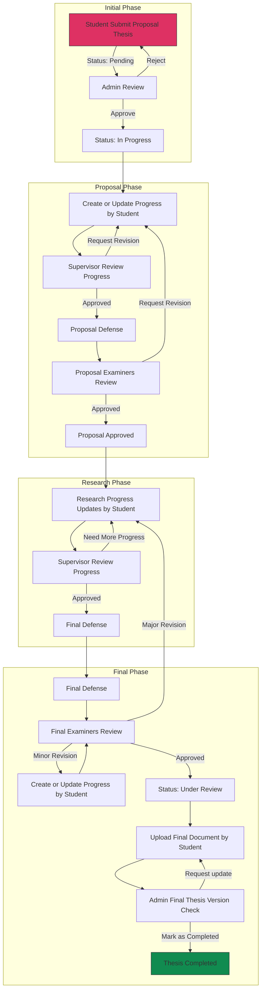

# Thesis Tracking Flow and Phases

## Phase Details and Progress Tracking

### 1. Initial Phase (10%)
**Status: `Pending`**
- Submit proposal thesis (5%)
- Admin review and approval (5%)
- Required documents:
  - Initial proposal
  - Student data
  - Research field

### 2. Proposal Phase (25%)
**Status: `In Progress`**
- Create/Update progress by student (10%)
- Supervisor review and feedback (5%)
- Proposal defense preparation (5%)
- Proposal defense execution (5%)
- Required milestones:
  - `ProposalDefenseApprovedAt` by supervisors
  - Initial `ThesisLectures` assignments
  - Examiner panel assignment

### 3. Research Phase (35%)
**Status: `In Progress`**
- Research progress updates (15%)
- Supervisor review and feedback (10%)
- Research implementation (5%)
- Data collection and analysis (5%)
- Required updates:
  - Regular progress submissions
  - Supervisor meetings
  - Research documentation
  - Progress tracking

### 4. Final Phase (30%)
**Status: `Under Review` → `Completed`**
- Final defense preparation (5%)
- Final defense execution (10%)
- Final document submission (5%)
- Final approvals (5%)
- Administrative completion (5%)
- Required completions:
  - `FinalDefenseApprovedAt` by examiners
  - `FinalDocumentURL` uploaded
  - `FinalizeApprovedAt` by all parties

## Status Transitions and Requirements

### Status: Pending
- Initial submission complete
- Awaiting admin review
- Required documents submitted

### Status: In Progress
- Admin approved initial submission
- Active in proposal or research phase
- Regular progress updates required

### Status: Under Review
Requirements:
- `IsProposalReady = true`
- `IsFinalExamReady = true`
- Final document uploaded
- All supervisor approvals
- All examiner approvals
- Final defense completed

### Status: Completed
Requirements:
- All phases 100% complete
- All approvals obtained
- Final document verified
- Admin completion marking
- All milestones achieved

## Defense Process Details

### 1. Proposal Defense
- Student completes proposal phase
- Supervisors approve proposal for defense
- Admin assigns proposal defense examiners
- Examiners review during proposal defense
- Possible outcomes:
  - Approved: Proceed to research phase
  - Revision needed: Return to proposal phase
  - Rejected: Major revision required

### 2. Final Defense
- Student completes research phase
- Supervisors approve for final defense
- Admin assigns final defense examiners
- Examiners review during final defense
- Possible outcomes:
  - Major revision: Return to research phase
  - Minor revision: Proceed with corrections
  - Approved: Status changes to "Under Review"

## Role Responsibilities

### Student
- Submit thesis proposal
- Create and update progress
- Submit progress updates
- Upload final document
- Address revision requests

### Supervisor
- Review thesis progress
- Provide feedback and guidance
- Approve for defense
- Monitor research progress

### Examiner
- Review thesis defense
- Provide defense feedback
- Approve for finalization

### Admin
- Review initial submission
- Assign supervisors
- Assign examiners
<!-- - Schedule defenses -->
- Verify final document
- Mark thesis as completed

## Progress Tracking System

### Progress Calculation
Total progress is calculated based on weighted completion of each phase:
- Initial Phase: 10%
- Proposal Phase: 25%
- Research Phase: 35%
- Final Phase: 30%

### Progress Validation Points
1. Proposal Ready:
   - All supervisors approved
   - Proposal defense complete
   - Required documents submitted

2. Final Exam Ready:
   - All examiners approved
   - Final defense complete
   - Research phase complete

3. Completion Ready:
   - Final document uploaded
   - All approvals received
   - All requirements met

Total progress must reach 100% for thesis to be eligible for completion. 